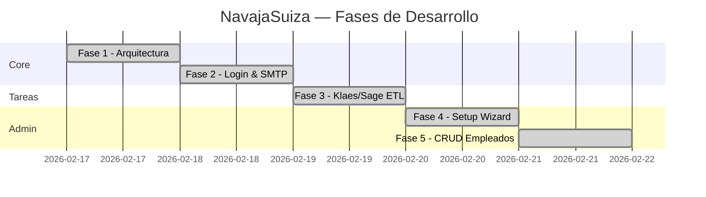

<div align="center">

# 🛫 Bitácora de Vuelo

### Desarrollo de NavajaSuiza — Cronología Completa

*Registro cronológico de cada fase de desarrollo, decisiones técnicas tomadas, y el razonamiento detrás de cada una.*

</div>

---

## 📅 Línea Temporal



---

## 🏗️ Fase 1 — Inicialización y Arquitectura

> **Objetivo:** Montar la estructura base del proyecto full-stack.

### Decisiones Técnicas

| Decisión | Alternativas | Elección | Razón |
|----------|-------------|----------|-------|
| Framework Backend | Flask, FastAPI | **Django 5** | ORM integrado, admin panel, migraciones |
| Framework Frontend | React, Svelte | **Vue 3** | Composition API, curva de aprendizaje suave |
| Auth | Sessions, OAuth | **JWT (SimpleJWT)** | Stateless, compatible con SPA |
| Bundler | Webpack, Parcel | **Vite** | HMR ultrarrápido, zero-config |
| State Mgmt | Vuex, composables | **Pinia** | API moderna, DevTools integrado |

### Archivos Creados

```
backend/
├── config/settings.py      ← Django settings con .env
├── config/urls.py           ← Router principal
├── users/models.py          ← CustomUser (AbstractUser)
├── users/serializers.py     ← Login, Profile, Admin
├── users/views.py           ← LoginView, ProfileView
├── core/permissions.py      ← IsSuperAdmin permission
├── manage.py
└── requirements.txt

frontend/
├── src/views/LoginView.vue      ← Login glassmorphism
├── src/views/DashboardView.vue  ← 8-button grid
├── src/stores/auth.js           ← Pinia auth store
├── src/api/axios.js             ← Axios con interceptors
├── src/router/index.js          ← Vue Router + guards
└── src/components/ToolButton.vue
```

### Resultado
- ✅ Login funcional con JWT
- ✅ Dashboard de 8 botones con diseño glassmorphism
- ✅ Roles: SuperAdmin / Admin / Empleado
- ✅ SuperAdmin creado con `manage.py create_superadmin`

---

## 📧 Fase 2 — Sistema de Login Empresarial y SMTP

> **Objetivo:** Permitir al SuperAdmin dar de alta empleados y enviarles credenciales por email corporativo.

### Integración SMTP (Dinahosting)

```
Flujo: SuperAdmin → Crea empleado → Django genera credenciales
       → Envía email HTML (@acristalia.com) → Empleado recibe login
```

**Configuración:**
- Servidor: `mail.acristalia.com` (puerto 465, SSL)
- Cuenta: `no-reply@acristalia.com`  
- Email HTML con diseño dark-theme corporativo

### Decisión Clave: Rollback vs. No-Rollback

| Versión | Comportamiento | Razón de cambio |
|---------|----------------|-----------------|
| v1 (Fase 2) | Si email falla → **borrar usuario** | Evitar cuentas huérfanas |
| v2 (Fase 5) | Si email falla → **mantener usuario** | Admin puede comunicar credenciales manualmente |

### Archivos Clave
- `backend/core/email_service.py` — `build_welcome_html()` + `send_welcome_email()`
- `backend/.env.example` — Variables SMTP

---

## 📄 Fase 3 — Tarea 1: Klaes → ETL → Sage X3

> **Objetivo:** Pipeline automatizado para reprocesar archivos XML de Klaes e importarlos a Sage X3.

### Pipeline de 6 Pasos

```
📄 Código QR  →  🔍 Buscar XML  →  📂 Copiar  →  ⚙️ ETL  →  💾 CSV Backup  →  🚀 Sage X3
  (Q/R+7dig)     (3 rutas)       (import dir)   (subprocess)  (timestamp)      (SOAP WS)
```

| Paso | Servicio | On Error |
|------|----------|----------|
| 1 | `validate_code` — Regex `^[QR]\d{7}$` | Abort |
| 2 | `search_xml` — Búsqueda secuencial en 3 rutas | Abort |
| 3 | `copy_to_import` — Copy a carpeta importación | Abort |
| 4 | `execute_etl` — Subprocess, timeout 120s | Abort (no llamar Sage) |
| 5 | `backup_csv` — `importacioncsv_{YYYYMMDD_HHMMSS}.csv` | Warning (continúa) |
| 6 | `send_to_sage` — SOAP Web Service (plantilla KLAES) | Error (CSV preservado) |

### Seguridad: Path Traversal
```python
def _sanitize_path(base_dir, filename):
    """Resuelve la ruta y verifica que esté DENTRO del directorio base."""
    resolved = (Path(base_dir) / filename).resolve()
    if not str(resolved).startswith(str(Path(base_dir).resolve())):
        raise ValueError("Path traversal detectado")
    return resolved
```

### Archivos
- `backend/tools/klaes_service.py` — Pipeline completo
- `backend/tools/views.py` — `KlaesReprocessView`
- `frontend/src/views/KlaesReprocessView.vue` — Consola de progreso visual

---

## ⚙️ Fase 4 — Gestor de Configuración (.env Setup Wizard)

> **Objetivo:** Interfaz web para configurar las variables de entorno sin editar archivos manualmente.

### Arquitectura

```
Frontend (EnvSetupView.vue)
    ↓ GET /api/config/status/
Backend reads .env → compares vs REQUIRED_ENV_VARS (22 vars)
    ↓ Returns grouped JSON with is_set flags
Frontend renders semaphore cards (✅/⚠️)
    ↓ POST /api/config/update/ {key, value}
Backend writes to .env (preserving comments)
```

### 22 Variables en 4 Grupos

| Grupo | Variables |
|-------|-----------|
| 🔧 Django (2) | `SECRET_KEY`, `DEBUG` |
| 📧 Email SMTP (8) | `EMAIL_HOST`, `EMAIL_PORT`, `EMAIL_USE_SSL/TLS`, `EMAIL_HOST_USER/PASSWORD`, `DEFAULT_FROM_EMAIL`, `FRONTEND_URL` |
| 📄 Klaes/ETL (6) | `PATH_BUSQUEDA_1/2/3`, `PATH_IMPORTACION_QR`, `PATH_OUTPUT_CSV`, `CMD_ETL_KLAES_SAGE` |
| 🏭 Sage X3 (6) | `SAGE_WS_URL/USER/PASSWORD`, `SAGE_POOL_ALIAS`, `SAGE_WS_LANGUAGE/IMPORT_TEMPLATE` |

### Reglas de Negocio
1. **Solo primera vez:** Si una variable ya tiene valor real → `409 Conflict`
2. **Sensibles protegidas:** Passwords NUNCA se devuelven al frontend
3. **Preserva estructura:** Los comentarios del `.env` no se borran

### Archivos
- `backend/core/env_config_service.py` — Schema + parser/writer
- `backend/core/views.py` — GET status + POST update
- `frontend/src/views/EnvSetupView.vue` — UI semáforo

---

## 👥 Fase 5 — CRUD Completo de Empleados

> **Objetivo:** Evolucionar el formulario de alta a un gestor CRUD completo con tabla reactiva.

### Evolución del Modelo

```diff
 class CustomUser(AbstractUser):
     role = CharField(choices=Role)
     empleado_id = CharField(unique=True)
     departamento = CharField()
     is_blocked = BooleanField()
+    readable_password = CharField()  # Texto plano para admin
```

### API Endpoints

| Method | Path | Description |
|--------|------|-------------|
| GET | `/api/admin/employees/` | Lista con `readable_password` |
| POST | `/api/admin/employees/` | Crear + enviar email |
| PATCH | `/api/admin/employees/{id}/` | Editar (sincroniza ambas passwords) |
| DELETE | `/api/admin/employees/{id}/` | Eliminación permanente |

### Sincronización de Passwords
```
CREATE  → set_password(hash) + readable_password = plain
UPDATE  → if new password: set_password(hash) + readable_password = new
```

### Interfaz de Tabla

| Columna | Contenido |
|---------|-----------|
| ID | Badge con `empleado_id` |
| Nombre | Avatar con iniciales + nombre completo + departamento |
| Email | Dirección corporativa |
| Contraseña | Texto oculto con 👁 toggle (muestra/oculta) |
| Rol | Badge coloreado (🔑 SuperAdmin, ⚙️ Admin, 👤 Empleado) |
| Acciones | ✏️ Editar (modal) + 🗑️ Eliminar (confirmación) |

### Archivos
- `backend/users/models.py` — `readable_password` field
- `backend/users/serializers.py` — `EmployeeListSerializer`, `EmployeeUpdateSerializer`
- `backend/users/views.py` — `EmployeeListCreateView`, `EmployeeDetailView`
- `frontend/src/views/AdminEmployeesView.vue` — Tabla + modales

---

## 🗺️ Mapa de Navegación Final

```
Login (/)
  └── Dashboard (8 botones)
        ├── 1. Reprocesar Klaes    → /tools/klaes
        ├── 2. Informes            → (pendiente)
        ├── 3. Documentos          → (pendiente)
        ├── 4. Calendario          → (pendiente)
        ├── 5. Mensajería          → (pendiente)
        ├── 6. Seguridad           → (pendiente)
        ├── 7. Gestión Usuarios    → /admin/employees
        └── 8. Configuración       → /config/setup
```

---

## 📊 Estado del Repositorio

| Componente | Archivos | Estado |
|------------|----------|--------|
| Backend Django | 18 | ✅ Producción |
| Frontend Vue | 10 | ✅ Producción |
| Migraciones | 2 | ✅ Aplicadas |
| Documentación | 3 | ✅ README + AGENTS + WALKTHROUGH |
| Tests | 0 | ⏳ Pendiente |

---

<div align="center">

*Bitácora generada por el Equipo de Agentes de NavajaSuiza.*
*Última actualización: Febrero 2026*

</div>
